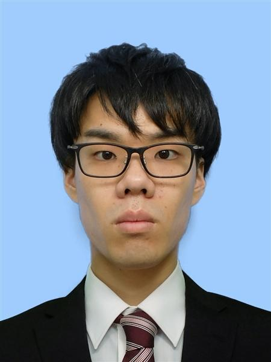

# Curriculum Vitae

As of July 2026

## Personal Details

| Field | Details |
| --- | --- |
| Name | Kenjin Nakaza (仲座 顕仁) |
| Gender | Male |
| Date of birth | July 5, 1994 (age 32) |
| Address | 8-29-54 Hashimoto, Midori-ku, Sagamihara-shi, Kanagawa 252-0143, Japan |
| Phone | 080-6491-7931 |
| Email | nakaza.recruit@gmail.com |

## Professional Summary

Full-stack engineer experienced in designing, developing, and operating web applications, cloud infrastructure, and data processing systems. Able to work across the entire development lifecycle, from requirements definition and technology selection through infrastructure, backend API and frontend development, testing, operations, and maintenance.

Currently developing a cloud-based drone surveying service, with a primary focus on cloud infrastructure, including AWS, and backend systems. Responsibilities span the design and implementation of image-processing APIs and GPU-based asynchronous processing infrastructure, as well as releases, incident response, and production operations.

Previously worked on a recommendation system for a major e-commerce platform, AI-powered web applications, and mobile applications. Also processed and analyzed marketing datasets ranging from tens of millions to billions of records and evaluated the effectiveness of marketing initiatives.

In addition to this development experience, regularly uses English when collaborating with overseas offices and international team members. Proactively adopts tools and practices that make work smoother and more efficient, including the use of AI in day-to-day development.

## Technical Skills

| Area | Technologies |
| --- | --- |
| Programming languages | Python, TypeScript, PHP, Dart, SQL |
| Runtime | Node.js |
| Backend frameworks | FastAPI, Django, Laravel |
| Frontend frameworks | React, Flutter |
| AWS | S3, Lambda, EC2, ECS, Fargate, Batch, RDS, DynamoDB, ElastiCache, EMR, EKS |
| Azure | App Service, OpenAI API |
| GCP | Cloud Run, Vertex AI |
| Firebase | Firestore, Cloud Functions |
| Data processing and numerical computing | PySpark, pandas, NumPy |
| Machine learning | scikit-learn, LightGBM, TensorFlow, YOLO |
| Workflow and job management | Airflow, JP1 |
| Databases and caching | PostgreSQL, MySQL, Redis |
| Development and container platforms | Git, Docker |
| Infrastructure as Code | Terraform, AWS SAM, CloudFormation |
| Domains | GIS, recommendation systems, image recognition |

## Career History

| Period | Employer |
| --- | --- |
| April 2019 – March 2022 | Keysight Technologies International Japan G.K. (left for personal reasons) |
| April 2022 – November 2024 | ARISE analytics, Inc. (left for personal reasons) |
| January 2025 – Present | SkymatiX, Inc. |

## Professional Experience

### SkymatiX, Inc. — January 2025 to Present

| Field | Details |
| --- | --- |
| Business | Planning, development, and sales of industrial remote-sensing services; education and training services |
| Employment type | Full-time employee |

Develop and operate KUMIKI, a cloud-based drone surveying service, as part of a team of approximately 10. Work across AWS-based processing infrastructure, backend APIs, a React frontend, and production operations.

#### Redesign of a GPU Image-Processing Queueing Platform

- The previous architecture accepted image-processing requests from the frontend and asynchronously launched GPU instances from the backend via AWS Lambda to execute the jobs.
- When a GPU instance was unavailable, the Lambda function retried by invoking itself and repeatedly attempting to launch an instance. If GPU capacity was exhausted within the region, multiple Lambda invocations competed for EC2 instances, requiring manual recovery and incurring unnecessary charges from concurrent and recursive Lambda executions.
- Served as the primary engineer for selecting the architecture and technologies and for designing and building a new queueing platform to resolve these issues.
- Built a solution with AWS Batch that safely queues jobs when GPU instances are unavailable, searches for suitable alternative instance types, and resumes processing while preserving job priority and submission order.
- As a result, manual recovery caused by GPU capacity shortages was almost eliminated, and costs from concurrent and recursive Lambda executions were reduced.
- Introduced Terraform as the company's first use of the tool, enabling the environment to be reproduced and extended more easily in preparation for future multi-cloud deployment.

**Technologies:** AWS Lambda (Node.js), AWS Batch, Terraform, AWS SAM

#### Refactoring of an Image-Processing API

- The existing image-processing API combined multiple responsibilities, including invoking image-processing tasks and coordinating generated files. Tight coupling between processes made the system prone to defects.
- Worked with the team to review the responsibility boundaries and decomposition strategy. Took ownership of separating key responsibilities and migrating the existing processing logic.
- Transitioned incrementally to the new architecture, validating each processing unit to minimize the impact on existing users.
- Added unit tests for the separated processes and integration tests spanning the API, image processing, and generated-file coordination, reducing defects.

**Technologies:** Python, REST API, Amazon S3

#### Image Upload Validation Using Metadata

- Developed a feature that validates aerial-image metadata in real time to prevent downstream failures caused by customers uploading unsuitable images.
- Handled the full process, including requirements definition, technology selection, AWS architecture, API design, implementation, and testing.
- Compared multiple infrastructure architectures and built a system that met the requirement of responding within 10 seconds without disrupting the user experience.

**Technologies:** Python, FastAPI, ECS on Fargate, Redis/Valkey

#### Monitoring Tools for Detecting Silent Failures

- Built multiple AWS Lambda monitoring tools to detect jobs that showed no progress for a specified period and failed to transition to a completed state.
- Led the design and implementation of monitoring conditions, detection logic, the Lambda architecture, Slack notifications, and tests.
- Enabled stalled processes with no explicit errors to trigger Slack notifications, allowing silent failures to be detected early without waiting for reports from users or internal staff.

**Technologies:** AWS Lambda, Slack

#### Production Incident Investigation, Recovery, and Permanent Remediation

- When incidents occurred, such as files not being generated or processing stopping midway, analyzed application logs, processing states in the database, and generated files in Amazon S3 to identify the root cause.
- Created temporary recovery procedures to reprocess affected data or restore missing generated files and return the service to an operational state.
- Handled the entire response lifecycle, from root-cause investigation and temporary recovery through the design, implementation, and release of permanent fixes.

#### Automatic Coordinate Reference System Detection for Capture Locations

- The previous system used services such as Google's Reverse Geocoding API to infer the coordinate reference system of a capture location from aerial-image location data. Implemented a process that searches pre-generated terrain polygons for the polygon containing the capture location and determines the coordinate reference system. This improved accuracy while eliminating external API costs.

**Technologies:** Python, AWS Lambda, GIS

#### Collaboration in English

- Conduct meetings and collaborative work in English with international team members and participate in internal study sessions held in English.

### ARISE analytics, Inc. — April 2022 to November 2024

| Field | Details |
| --- | --- |
| Business | Analytics services, including data analysis, algorithm development, and support for implementing DMP, AI, and IoT solutions |
| Employment type | Full-time employee |

#### Development and Operation of a Recommendation System for a Major E-Commerce Platform (Team of Approximately 10)

- Led the impact analysis, field mapping, transformation design, implementation, and validation required to migrate from a discontinued recommendation data mart to a replacement with a different schema.
- Completed the migration before the legacy data mart's retirement deadline without affecting the service or reducing recommendation quality.
- Developed new recommendation logic and improved existing logic, then evaluated its impact after release through significance testing in A/B tests.
- Developed daily processing workflows covering data transformation, model training and inference, and recommendation-list generation.
- Investigated root causes, reported incidents to the client, and restored service when production incidents occurred.

**Technologies:** Python, PySpark, pandas, Airflow, Amazon S3, Amazon EC2, Amazon EMR, Amazon EKS

#### Development and Operation of Generative AI Web Applications (Team of Approximately 10)

- Contributed to applications that generated meeting minutes from audio data and coordinated meeting times among participants.
- Worked across backend development using APIs such as Django REST Framework and Azure OpenAI, React frontend enhancements, and deployment to Azure.
- Designed and implemented KPI measurement logs and improved database performance by creating SQL indexes.

**Technologies:** Python, Django REST Framework, React, PostgreSQL, Azure App Service, Azure Functions, Azure OpenAI

#### Enhancements to a Flutter Healthcare Application (Team of Approximately 5)

- Updated the UI and presentation of selected screens and enhanced existing features in a Flutter mobile application.

**Technologies:** Flutter, Dart

#### Marketing Data Analysis and Consulting (Team of Approximately 5)

- Handled the full engagement lifecycle, including client interviews, analysis requirements definition, aggregation, insight generation, and presentations.
- Evaluated campaign effectiveness by analyzing trends in active users, new members, and churn before and after initiatives. Used PySpark to process datasets ranging from tens of millions to billions of records.

#### Slack Workflow Automation Bot

- Independently developed a bot that automated account provisioning for an internal training web service and implemented a serverless architecture that called the service API from Slack.

**Technologies:** TypeScript, Deno, Slack next-generation platform

#### Training for New Graduates and Mid-Career Hires

- Delivered introductory training on Linux, Git, Python, and PySpark.

### Keysight Technologies International Japan G.K. — April 2019 to March 2022

| Field | Details |
| --- | --- |
| Business | Measurement instruments and solutions for markets including information and communications technology, aerospace and defense, and semiconductors |
| Employment type | Full-time employee |

#### Manufacturing Process Design and Product Management

- Designed assembly processes and work procedures for new products and created instructions for overseas factories and jigs to reduce processing time and defects.
- Performed defect analysis and process improvement for existing products and managed bills of materials using a PLM tool.
- Communicated in English with colleagues at overseas factories and company headquarters.

#### RPA Development for Automating PLM Tool Operations (Team of 3)

- Identified a labor-intensive, error-prone process and designed and developed automation for PLM tool operations using Python and Selenium.
- Reduced operator errors and shortened the target task's completion time by approximately 60% through the automation tool.
- Provided user support and maintenance after the tool's release.

**Technologies:** Python, Selenium, Beautiful Soup, 3DEXPERIENCE ENOVIA, PTC Creo

## Personal Project

### ShareTan — Flutter Vocabulary Learning App

- Independently planned a mobile application that notifies users of English words at specified times and lets them share words they have learned with other users.
- Designed and developed the Flutter application and Firebase backend and released it on both Android and iOS after completing the respective store review processes.
- [Android](https://play.google.com/store/apps/details?id=com.nakazalab.notivocab&pcampaignid=web_share) / [iOS](https://apps.apple.com/jp/app/%E3%82%B7%E3%82%A7%E3%82%A2%E3%82%BF%E3%83%B3-%E8%A6%9A%E3%81%88%E3%81%9F%E8%8B%B1%E5%8D%98%E8%AA%9E%E3%81%AF%E4%BB%B2%E9%96%93%E3%81%A8%E5%85%B1%E6%9C%89%E3%81%97%E3%82%88%E3%81%86/id6755063411)

**Technologies:** Flutter, Dart, Riverpod, Firebase

## Education

| Date | Education |
| --- | --- |
| April 2010 | Entered the General Studies Program, Okinawa Shogaku High School |
| March 2013 | Graduated from the General Studies Program, Okinawa Shogaku High School |
| April 2013 | Entered the Department of Mechanical Engineering and Intelligent Systems, Faculty of Informatics and Engineering, The University of Electro-Communications |
| March 2017 | Graduated from the Department of Mechanical Engineering and Intelligent Systems, Faculty of Informatics and Engineering, The University of Electro-Communications |
| April 2017 | Entered the Master's Program in Mechanical and Intelligent Systems Engineering, Graduate School of Informatics and Engineering, The University of Electro-Communications |
| March 2019 | Completed the Master's Program in Mechanical and Intelligent Systems Engineering, Graduate School of Informatics and Engineering, The University of Electro-Communications |

## Licenses, Certifications, and Competition Results

- July 2009: Passed the EIKEN Grade 2 English proficiency test
- April 2015: Obtained a Japanese driver's license (semi-medium vehicles; automatic transmission only)
- April 2016: TOEIC score of 650
- September 2021: Passed the Japan Statistical Society Certificate, Grade 2
- Kaggle "American Express - Default Prediction": Top 9%, Bronze Medal
- Nishika image classification competition: Top 10%

## Additional Information

| Field | Details |
| --- | --- |
| Motivation, personal statement, hobbies, and special skills | — |
| Commute | Approximately 1 hour 30 minutes to central Tokyo |
| Dependents (excluding spouse) | None |
| Marital status | Married |
| Spouse financially dependent on applicant | No |
| Preferred employment conditions | In accordance with company policy |
