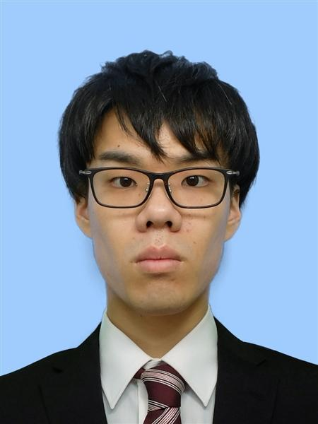

# Curriculum Vitae

As of July 2026

## Personal Details

| Field         | Details                                                                |
| ------------- | ---------------------------------------------------------------------- |
| Name          | Kenjin Nakaza (仲座 顕仁)                                              |
| Gender        | Male                                                                   |
| Date of birth | July 5, 1994 (age 32)                                                  |
| Address       | 8-29-54 Hashimoto, Midori-ku, Sagamihara-shi, Kanagawa 252-0143, Japan |
| Phone         | 080-6491-7931                                                          |
| Email         | nakaza.recruit@gmail.com                                               |

## Professional Summary

Engineer specializing in AWS and backend systems, with experience spanning requirements definition, technology selection, design, implementation, testing, and production operations. Strengths include resolving operational issues through improvements to processing infrastructure and APIs, and carrying incident response through to permanent fixes.

In the current role, served as the primary engineer for migrating a drone surveying service's GPU processing platform to AWS Batch, achieving zero manual recoveries due to GPU capacity shortages during the approximately three months following deployment. Also built an image validation API and monitoring tools to detect stalled jobs.

Previously served as the primary engineer for a recommendation system's data mart migration at a major e-commerce platform, completing it before the deadline without affecting the service. Additional experience includes processing and analyzing tens of millions to billions of records, developing React interfaces, and collaborating in English with overseas offices and international colleagues.

## Technical Skills

| Area | Key Technologies and Practical Experience |
| --- | --- |
| Languages | Python, PHP, TypeScript, SQL, Dart |
| Cloud and Infrastructure as Code | AWS (Batch, Lambda, ECS / Fargate, S3, EC2, ElastiCache), Terraform, AWS SAM: processing infrastructure and APIs Azure App Service, Azure Functions: web application development and operations |
| Backend | FastAPI, Django REST Framework, Laravel, Node.js: APIs and asynchronous processing |
| Databases and Data Processing | MySQL, PostgreSQL, Redis, PySpark, pandas, Apache Airflow: schema changes, performance improvements, and data workflows |
| Frontend and Mobile | React, Flutter, Firebase: UI development and enhancements; personal app development and release |
| Other | Azure OpenAI: generative AI applications / GIS: coordinate reference system detection / Selenium: workflow automation |

## Career History

| Period                     | Employer                                                                   |
| -------------------------- | -------------------------------------------------------------------------- |
| April 2019 – March 2022    | Keysight Technologies International Japan G.K. (left for personal reasons) |
| April 2022 – November 2024 | ARISE analytics, Inc. (left for personal reasons)                          |
| January 2025 – Present     | SkymatiX, Inc.                                                             |

## Professional Experience

### SkymatiX, Inc. — January 2025 to Present

| Field | Details |
| --- | --- |
| Business | Planning, development, and sales of industrial remote-sensing services; education and training services |
| Employment type | Full-time employee |

Develop and operate KUMIKI, a cloud-based drone surveying service, in a team of approximately 10. The service has nearly 10,000 registered users and averages approximately 30 image-processing requests per day. Focus on AWS processing infrastructure and backend systems, with responsibilities extending to React interfaces. Conduct meetings and collaborative work in English with international team members.

#### Improving GPU Processing Reliability

- Addressed an architecture that used recursive Lambda invocations to retry when GPU instances were unavailable. During peak periods, stalled jobs required manual recovery approximately once per month, while concurrent invocations incurred unnecessary costs.
- Served as the primary engineer for technology selection, design, and implementation of an AWS Batch-based queueing platform. The platform holds jobs while preserving priority and submission order, and obtains available GPU resources across multiple instance types.
- Achieved zero manual recoveries due to GPU capacity shortages during the approximately three months following deployment, and reduced unnecessary costs from concurrent and recursive Lambda invocations.
- Introduced the company's first use of Terraform to make infrastructure reproducible and easier to extend, with Lambda functions managed through AWS SAM.

**Technologies:** AWS Lambda (Node.js), AWS Batch, Terraform, AWS SAM

#### Building an Image Validation API to Prevent Downstream Failures

- Built a microservice to validate aerial-image metadata in real time and prevent downstream processing failures caused by unsuitable images.
- Separated the FastAPI server and validation workers on ECS / Fargate, using ElastiCache for Redis as a job queue and cache.
- Handled requirements definition, technology selection, AWS architecture, API design, implementation, and testing, meeting the requirement to respond within 10 seconds.

**Technologies:** Python, FastAPI, Amazon ECS, AWS Fargate, Amazon ElastiCache for Redis

#### Detecting Stalled Jobs and Resolving Production Incidents

- Built AWS Lambda monitoring tools to detect jobs that remain incomplete with no progress for a specified period and send Slack alerts. Served as the primary engineer from monitoring criteria design through implementation and testing, enabling detection without waiting for user reports.
- Identified the causes of missing output files and stalled processing by correlating application logs, job states in the database, and generated files in S3.
- Handled recovery through reprocessing and file restoration, followed by the design, implementation, and release of permanent fixes.

**Technologies:** AWS Lambda, Amazon S3, Slack

#### Delivering Coordinate Reference System Suggestions from API to UI

- Developed a feature that determines the coordinate reference system from aerial-image location data and presents it to the user as a candidate.
- Implemented a terrain-polygon lookup to identify the region containing the capture location, exposed through a Lambda Function URL, without using an external reverse-geocoding API.
- Implemented the complete feature across the Lambda API, Laravel backend, and React interface for displaying candidates.

**Technologies:** Python, AWS Lambda, Lambda Function URL, PHP, Laravel, React, GIS

#### Improving Existing Features and Maintainability

- Worked with the team to restructure terrain-image generation processing with unclear responsibilities and dependencies. Personally handled splitting and reorganizing key steps, removing unnecessary processing, and migrating incrementally.
- Added unit tests and integration tests covering the complete processing workflow, making the system easier to change and maintain.
- Developed Laravel APIs for managing PDFs displayed on maps, including MySQL schema changes, migrations, and tests.

**Technologies:** Python, Amazon S3, PHP, Laravel, MySQL

### ARISE analytics, Inc. — April 2022 to November 2024

| Field | Details |
| --- | --- |
| Business | Analytics services, including data analysis, algorithm development, and support for implementing DMP, AI, and IoT solutions |
| Employment type | Full-time employee |

#### Migrating, Developing, and Operating an E-Commerce Recommendation System (Team of Approximately 10)

- Served as the primary engineer for migrating from a retiring data mart to a replacement with a different schema. Handled impact analysis, field mapping, transformation design, implementation, and validation, completing the migration before the retirement deadline without affecting the service.
- Developed new recommendation logic and improved existing logic, evaluating the effects after release through statistical significance testing in A/B tests.
- Built daily workflows for data transformation, model training and inference, and recommendation-list generation.
- Investigated production incidents, reported findings to the client, and restored service.

**Technologies:** Python, PySpark, pandas, Apache Airflow, Amazon S3, Amazon EC2

#### Developing and Operating Generative AI Web Applications (Team of Approximately 10)

- Contributed to applications for generating meeting minutes from audio and coordinating meeting schedules.
- Developed backends with Django REST Framework and Azure OpenAI, enhanced React interfaces, and deployed applications to Azure.
- Designed and implemented KPI logging and improved database performance through SQL indexes.

**Technologies:** Python, Django REST Framework, React, PostgreSQL, Azure App Service, Azure Functions, Azure OpenAI

#### Data Analysis, Workflow Automation, and Other Contributions

- **Marketing analytics (team of approximately 5):** Processed tens of millions to billions of records with PySpark to evaluate campaign effectiveness. Handled client interviews, requirements definition, aggregation, insight generation, and reporting.
- **Workflow automation:** Independently developed an account-provisioning bot for an internal training web service, using TypeScript, Deno, and the Slack next-generation platform to call the service API from Slack.
- **Mobile development (team of approximately 5):** Updated selected screens and existing features in a Flutter / Dart healthcare application.
- **Internal training:** Delivered introductory Linux, Git, Python, and PySpark courses to new graduates and mid-career hires.

### Keysight Technologies International Japan G.K. — April 2019 to March 2022

| Field | Details |
| --- | --- |
| Business | Measurement instruments and solutions for markets including information and communications technology, aerospace and defense, and semiconductors |
| Employment type | Full-time employee |

#### Reducing Task Time through PLM Automation (Team of 3)

- Identified a labor-intensive, error-prone process and designed and developed PLM tool automation using Python and Selenium.
- Reduced operator errors and shortened the target task's completion time by approximately 60%.
- Provided user support and maintenance after release.

**Technologies:** Python, Selenium

#### Manufacturing Process Design and International Collaboration

- Designed assembly processes and work procedures for new products, created instructions and jigs for overseas factories, and handled defect analysis, process improvement, and bills of materials for existing products.
- Coordinated work in English with colleagues at overseas factories and company headquarters.

## Personal Project

### ShareTan — Flutter Vocabulary Learning App

- Independently planned an app that delivers scheduled vocabulary notifications and lets users share words they have learned.
- Designed and developed the Flutter app and Firebase backend, and published it on both Android and iOS after completing store reviews.
- [Android](https://play.google.com/store/apps/details?id=com.nakazalab.notivocab&pcampaignid=web_share) / [iOS](https://apps.apple.com/jp/app/%E3%82%B7%E3%82%A7%E3%82%A2%E3%82%BF%E3%83%B3-%E8%A6%9A%E3%81%88%E3%81%9F%E8%8B%B1%E5%8D%98%E8%AA%9E%E3%81%AF%E4%BB%B2%E9%96%93%E3%81%A8%E5%85%B1%E6%9C%89%E3%81%97%E3%82%88%E3%81%86/id6755063411)

**Technologies:** Flutter, Dart, Riverpod, Firebase, GCP, Cloud Run, Vertex AI

## Education

| Date       | Education                                                                                                                                                                  |
| ---------- | -------------------------------------------------------------------------------------------------------------------------------------------------------------------------- |
| April 2010 | Entered the General Studies Program, Okinawa Shogaku High School                                                                                                           |
| March 2013 | Graduated from the General Studies Program, Okinawa Shogaku High School                                                                                                    |
| April 2013 | Entered the Department of Mechanical Engineering and Intelligent Systems, Faculty of Informatics and Engineering, The University of Electro-Communications                 |
| March 2017 | Graduated from the Department of Mechanical Engineering and Intelligent Systems, Faculty of Informatics and Engineering, The University of Electro-Communications          |
| April 2017 | Entered the Master's Program in Mechanical and Intelligent Systems Engineering, Graduate School of Informatics and Engineering, The University of Electro-Communications   |
| March 2019 | Completed the Master's Program in Mechanical and Intelligent Systems Engineering, Graduate School of Informatics and Engineering, The University of Electro-Communications |

## Licenses, Certifications, and Competition Results

- July 2009: Passed the EIKEN Grade 2 English proficiency test
- April 2015: Obtained a Japanese driver's license (semi-medium vehicles; automatic transmission only)
- April 2016: TOEIC score of 650
- September 2021: Passed the Japan Statistical Society Certificate, Grade 2
- Kaggle "American Express - Default Prediction": Top 9%, Bronze Medal
- Nishika image classification competition: Top 10%

## Additional Information

| Field                                                       | Details                                          |
| ----------------------------------------------------------- | ------------------------------------------------ |
| Motivation, personal statement, hobbies, and special skills | —                                                |
| Commute                                                     | Approximately 1 hour 30 minutes to central Tokyo |
| Dependents (excluding spouse)                               | None                                             |
| Marital status                                              | Married                                          |
| Spouse financially dependent on applicant                   | No                                               |
| Preferred employment conditions                             | In accordance with company policy                |
